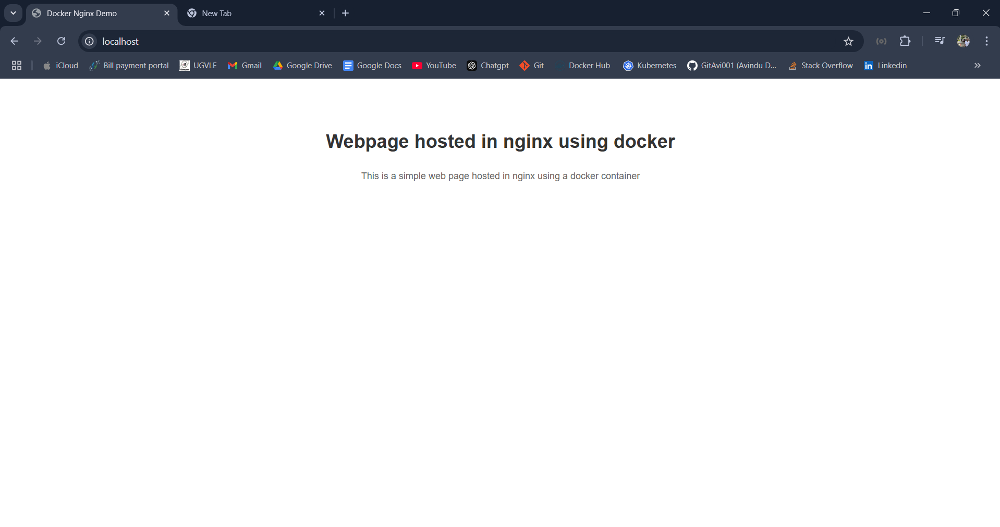

# docker-Nginx-webpage
Simple demo showing how to host a simple web page using nginx server and a docker container

## 1. Create the static web page

## 2. Create the base docker image with a tag
```bash
docker build -t webserver-image:v1 .
```

## 3. Run the docker container using the build base docker image
```bash
docker run -d -p 80:80 webserver-image:v1 
```
## 4. Sample page 

